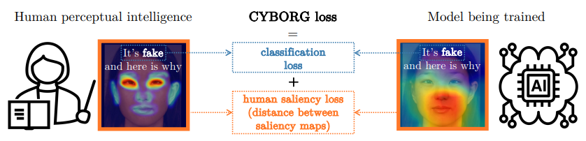
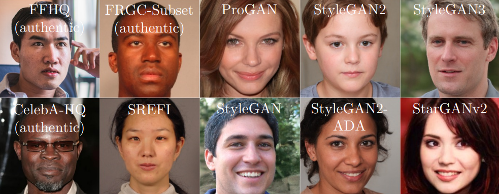
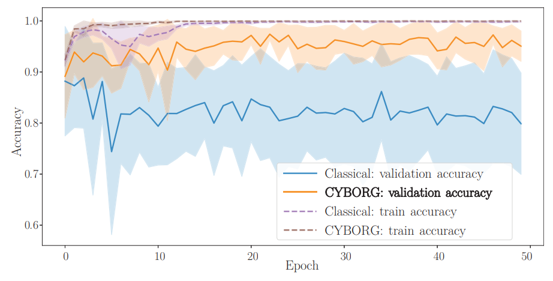
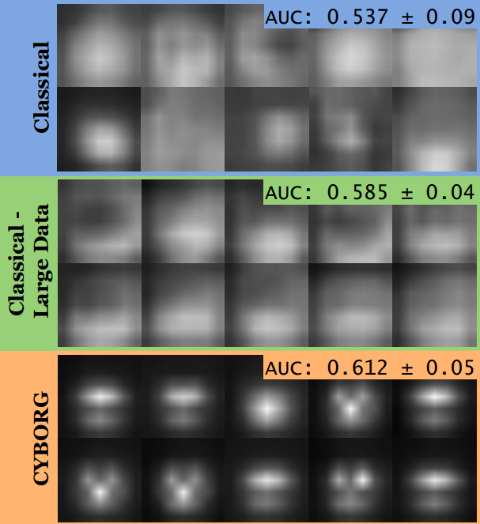

# CYBORG: Blending Human Saliency Into the Loss Improves Deep Learning-Based Synthetic Face Detection

Aidan Boyd, Patrick Tinsley, Kevin Bowyer, Adam Czajka  
University of Notre Dame, Notre Dame IN 46556, USA  
{aboyd3,ptinsley,kwb,aczajka}@nd.edu  
<a href="https://openaccess.thecvf.com/content/WACV2023/papers/Boyd_CYBORG_Blending_Human_Saliency_Into_the_Loss_Improves_Deep_Learning-Based_WACV_2023_paper.pdf">Official Paper</a>    

## Abstract

Can deep learning models achieve greater generalization if their training is guided by reference to human perceptual abilities? And how can we implement this in a practical manner? This paper proposes a training strategy to ConveY Brain Oversight to Raise Generalization (CYBORG). This new approach incorporates human-annotated saliency maps into a loss function that guides the model’s learning to focus on image regions that humans deem salient for the task. The Class Activation Mapping (CAM) mechanism is used to probe the model’s current saliency in each training batch, juxtapose this model saliency with human saliency, and penalize large differences. Results on the task of synthetic face detection, selected to illustrate the effectiveness of the approach, show that CYBORG leads to significant improvement in accuracy on unseen samples consisting of face images generated from six Generative Adversarial Networks across multiple classification network architectures. We also show that scaling to even seven times the training data, or using non-human-saliency auxiliary information, such as segmentation masks, and standard loss cannot beat the performance of CYBORG-trained models. As a side effect of this work, we observe that the addition of explicit region annotation to the task of synthetic face detection increased human classification accuracy. This work opens a new area of research on how to incorporate human visual saliency into loss functions in practice. All data, code and trained models used in this work are offered with this paper.

## Data Used

Two types of face image datasets are used: authentic datasets consisting of real images from three sources (CelebA-HQ, Flickr-Faces-HQ and FRGCSubset), and synthetic datasets consisting of fake images from seven different generators (ProGAN, StyleGAN, StyleGAN2, StyleGAN2-ADA, StyleGAN3, StarGANv2 and SREFI). The datasets are shown in the figure to the right.

   

## Results

To the right is a comparison of training and validation accuracy for ResNet50 with only classification accuracy loss versus with CYBORG loss. Training accuracy quickly approaches 100% for both. But CYBORG-trained models achieve significantly higher validation accuracy throughout, indicating more effective learning. The shaded area represents ±1 standard deviation of the accuracy by epoch.

         

## Model Comparison

Shown in this figure are the average CAMs across the entire test set for 10 independently trained ResNet50 models in three experimental settings. Each individual plot is the average CAM obtained for all test images for a given model. (Similar results can be observed for other CNN architectures, included into the supp. materials). Compared to the average human annotation, shown in Fig. 4(d), it is clear CYBORG models are guided effectively by human annotation.

